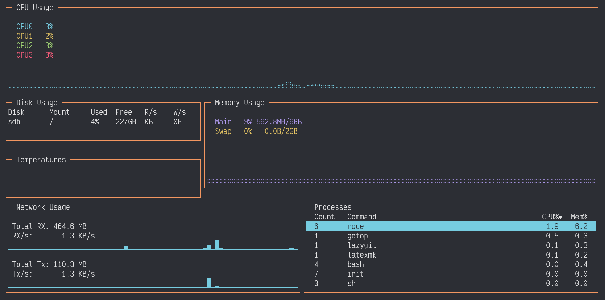
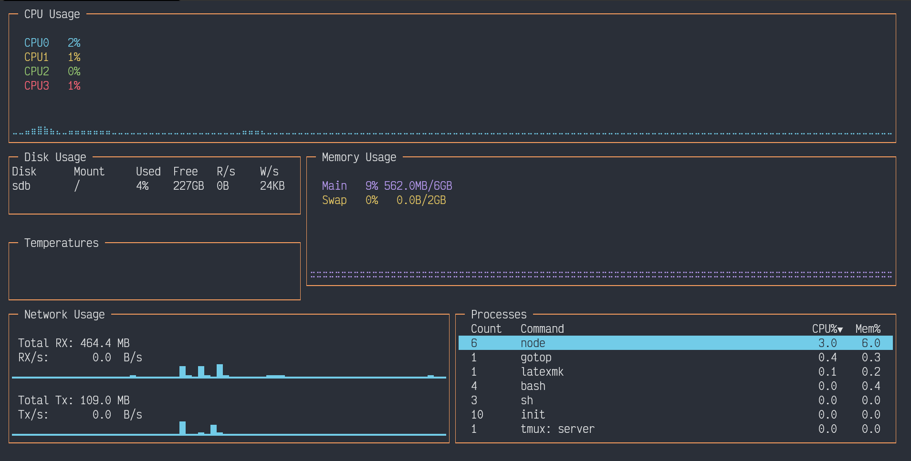
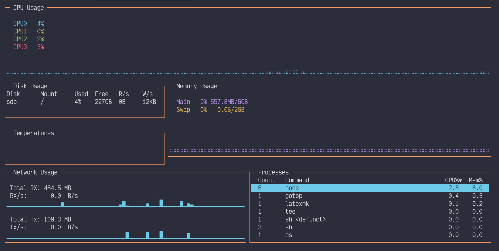
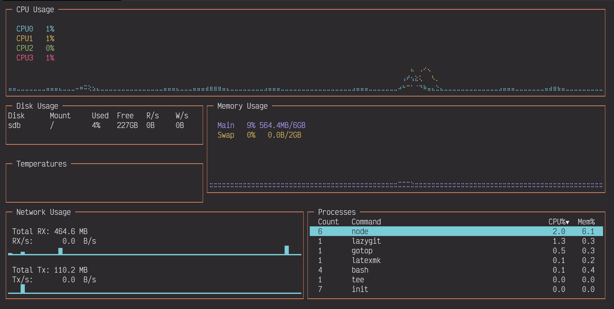
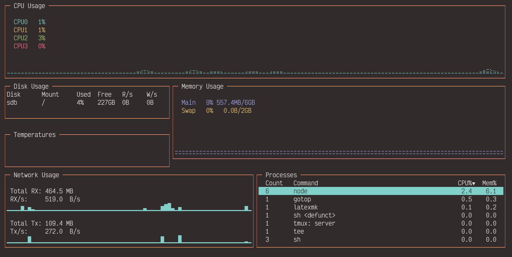

# sonokai-windows-terminal
A port of the [Sonokai](https://github.com/sainnhe/sonokai) colorscheme for Windows Terminal.

## How to Use
Copy and paste the **full** contents of the file containing your variant of choice into the Windows Terminal .json configuration file.

(See also: https://docs.microsoft.com/en-us/windows/terminal/customize-settings/color-schemes)

## Screenshots

	<h3>Default</h3>
	

	<h3>Atlantis</h3>
	

	<h3>Andromeda</h3>
	

	<h3>Shusia</h3>
	

	<h3>Maia</h3>
	

	<h3>Espresso</h3>
	

